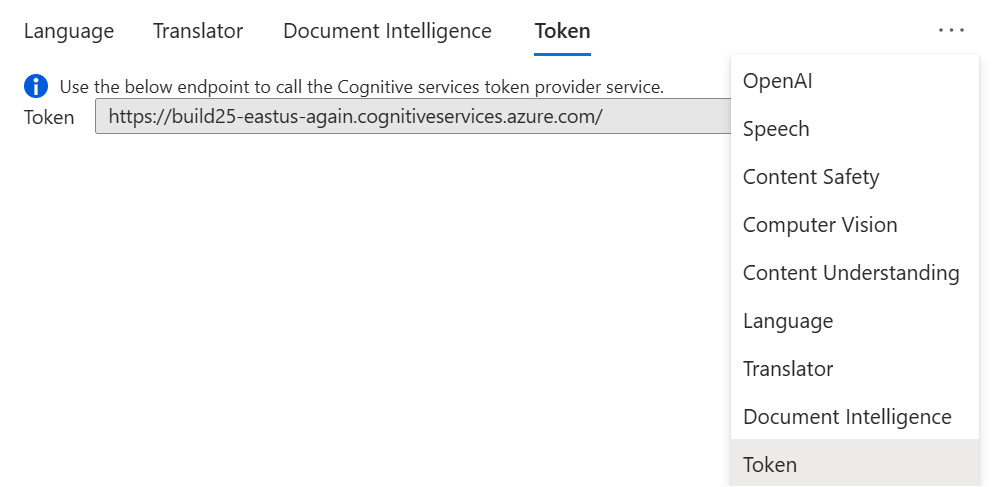
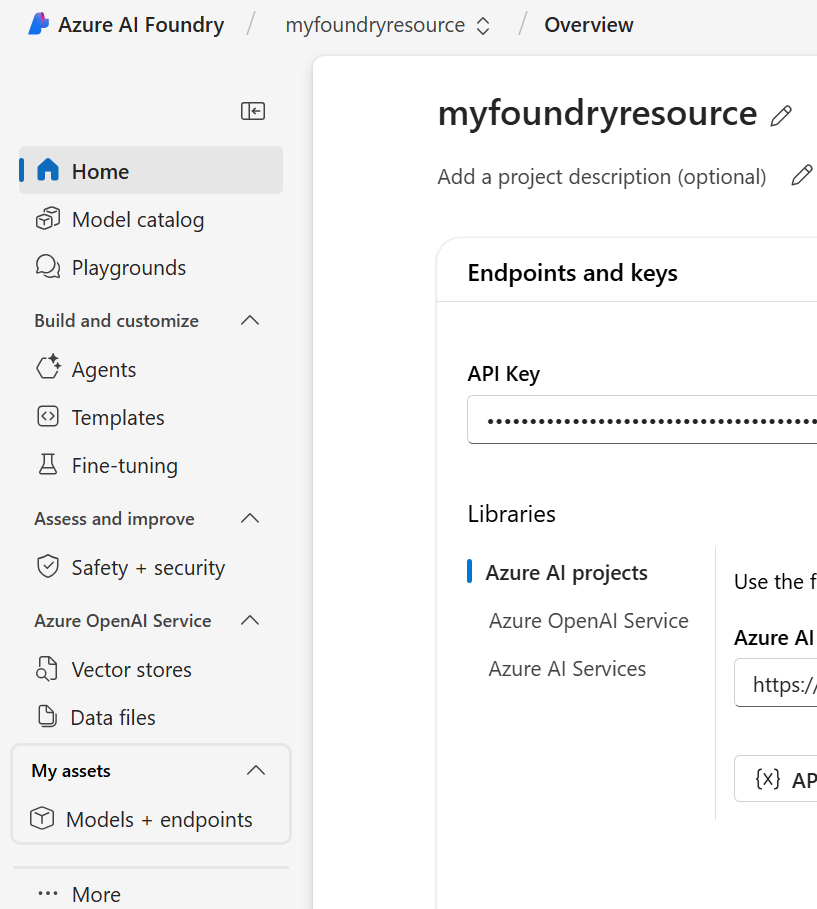
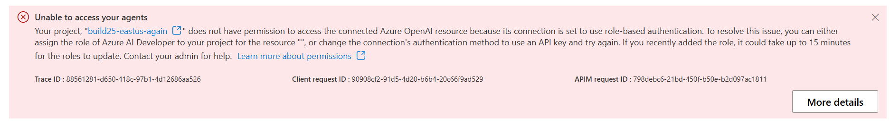

## Setup
 - P2: No project endpoint on the resource page
    
 - P2: openai-specific items on the left navigation
    
 

## Open in VS Code
 - P2: endpoint in project homepage should change from: https://build25-eastus-again.openai.azure.com to https://build25-eastus-again.services.ai.azure.com
 - P2: no python extension installed notification in open in vs code experience
 - P1: frequently disconnects 
 - P1: why is openai code using the preview version?

## Agents

 - P1: playground shows error message:
 

